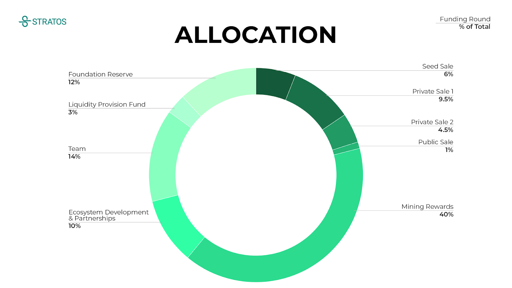

## STOS token utilities

- STOS will be staked/delegated to validators to secure the Blockchain network.
- STOS will be issued as Proof-of-Traffic mining reward.
- STOS will be consumed in the payment of the transaction fee.
- STOS will be prepaid for Stratos Resource Network service traffic fee.

## At a Glance

Token Ticker: STOS

Total Supply: 100,000,000

Initial Liquid Tokens: 8,125,000

Initial Market Price: 0.3 USD

## Token Allocation by Percent

Our total strategic sale (consisting of 1 seed and 2 private sale rounds) is 20% of all our tokens. The initial sale will be used for our technology development, community building, partnerships, and marketing to build out Stratos Decentralized Data Mesh.

## Token Unlock and Vesting Schedule

**Seed**: 25% unlocked at TGE[^1]. Quarterly vesting over 9 months.

**Private Sale 1**: 25% unlocked at TGE[^1]. Quarterly vesting over 9 months.

**Private Sale 2**: 30% unlocked at TGE[^1], Quarterly vesting over 9 months.

**Public**: 100% unlocked at TGE[^1].

**Team**: 10% unlocked at day 270. Quarterly vesting over 12 months.

**Ecosystem Development & Partnerships**: 10% unlocked at TGE[^1]. Remaining utilized when partnerships are established.

**Liquidity Provision Fund**: 30% unlocked at TGE[^1]. Remaining utilized for new exchange listing relationships.

**Foundation Reserve**: 10% unlocked at day 360. Remaining quarterly vesting over 12 months.

[^1]: Token Generation Event was on June 09, 2021